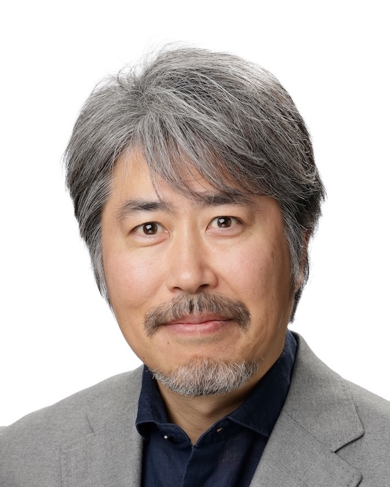

# Daisuke Niizumi

---

## About Me
I am a researcher in **audio signal processing, machine learning, and multimedia understanding**, focusing on **representation learning for audio and cross-modal applications**.  
My research aims to advance how machines perceive and understand sound, contributing to applications such as audio classification, retrieval, captioning, and multimodal analysis.

---

## Research Interests
- Audio representation learning (General-purpose audio representation)
- Audio–language models
- Self-supervised learning
- Sound event detection and classification (DCASE)

---

## Education
- **M.Eng.**, Kyushu Institute of Technology, Fukuoka, Japan  
- **B.Eng.**, Kyushu Institute of Technology, Fukuoka, Japan  

---

## Selected Publications
- D. Niizumi et al., *"Masked Modeling Duo: Towards a Universal Audio Pre-Training Framework,"*  
  **IEEE/ACM Trans. Audio, Speech, Language Process.**, 2024.  

- D. Niizumi et al., *"BYOL for Audio: Exploring Pre-trained General-purpose Audio Representations,"*  
  **IEEE/ACM Trans. Audio, Speech, Language Process.**, 2023.  

- D. Niizumi et al., *"M2D-CLAP: Exploring General-purpose Audio-Language Representations Beyond CLAP,"*  
  **IEEE Access**, 2025.  

👉 See the [full publication list](publications.md).

---

## Invited Talks
- *"音の聴き方を自ら学ぶAI: 自己教師あり学習による様々な音の汎用表現学習技術から、大規模言語モデルを活用した音の理解の最前線へ,"*  
  NTTコミュニケーション科学基礎研究所オープンハウス2025, 2025.  

- *"BYOL for Audio: Exploring Pre-Trained General-Purpose Audio Representations,"*  
  IEEE Signal Processing Society Webinar, 2024.  

👉 More in [publications.md](publications.md).

---

## Contact
- [Google Scholar](https://scholar.google.co.jp/citations?user=dTEKquEAAAAJ&hl=en)  
- [GitHub](https://github.com/daisukelab/)  
- [LinkedIn](https://www.linkedin.com/in/daisukeniizumi/)  

---

© 2025 Daisuke Niizumi
